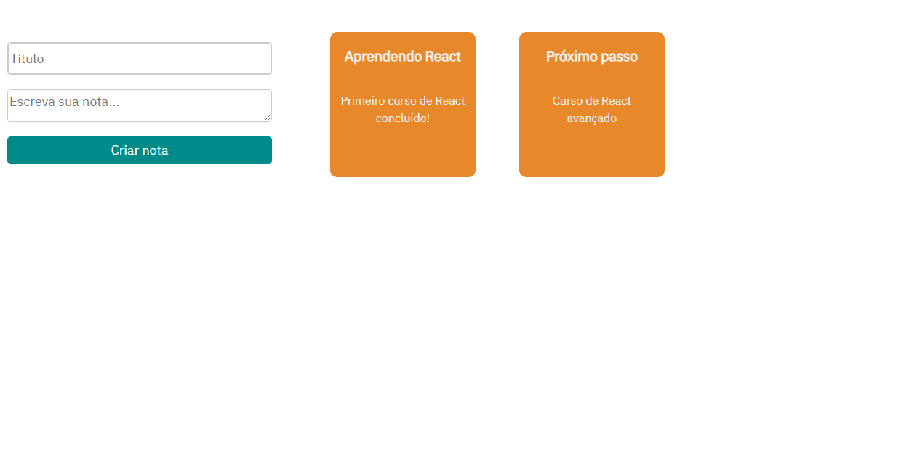

# React Quadro de tarefas

### `Versão 2`

### Lições aprendidas
- Receber props em componentes filhos
- estados de renderização

## Scripts disponíveis

Você pode iniciar esse projeto com o seguinte comando:

### `npm start`

Inicia a aplicação em modo de desenvolvimento\
Abrindo [http://localhost:3000](http://localhost:3000) para visualização no navegador.

A página será reiniciada após atualizações no código

### `npm run build`

Produzirá o arquivo de produção na pasta `build`.

O build é minificado e os nomes dos arquivos incluem os hashes.
Sua aplicação está pronta para a produção!

Veja a seção sobre deploy [deployment](https://facebook.github.io/create-react-app/docs/deployment) para mais informações.

